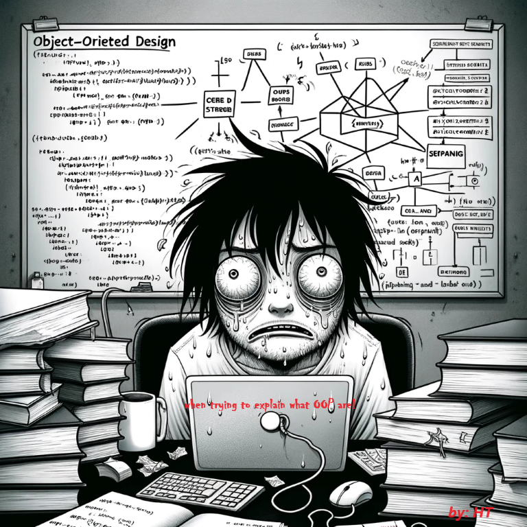
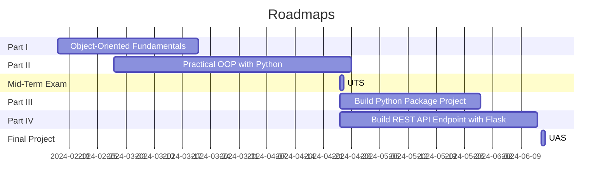
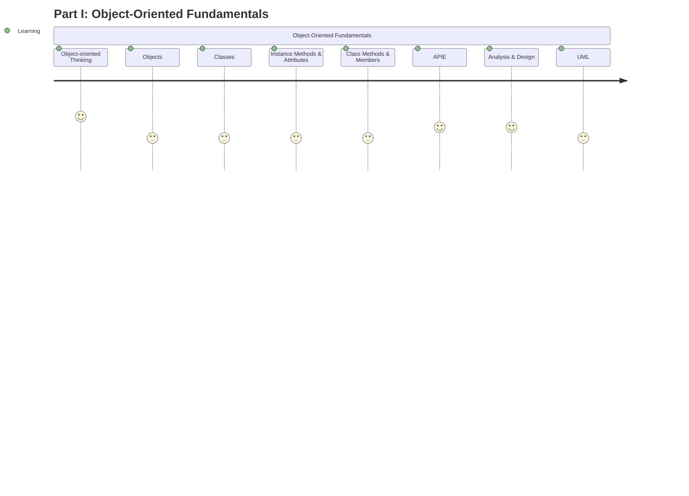
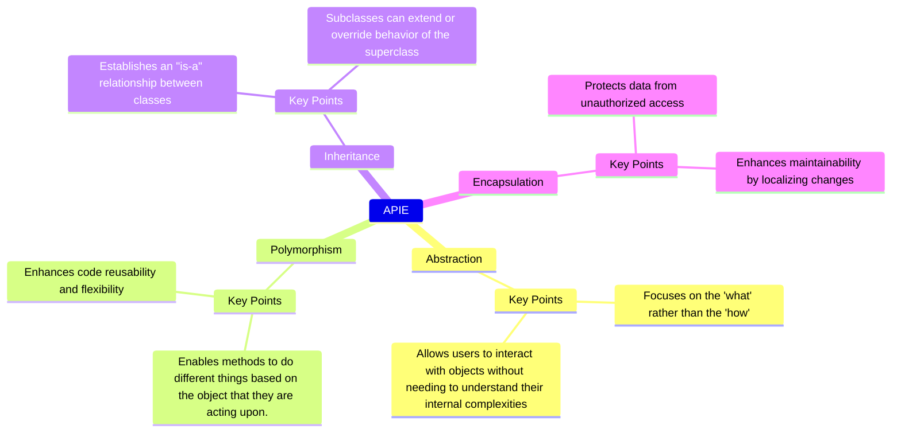
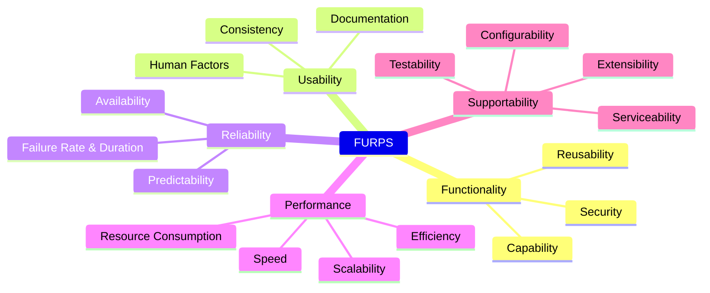
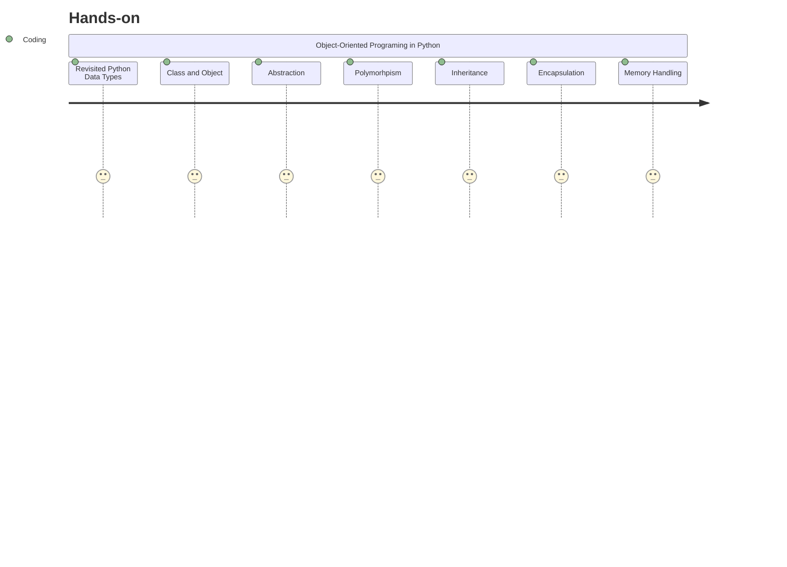
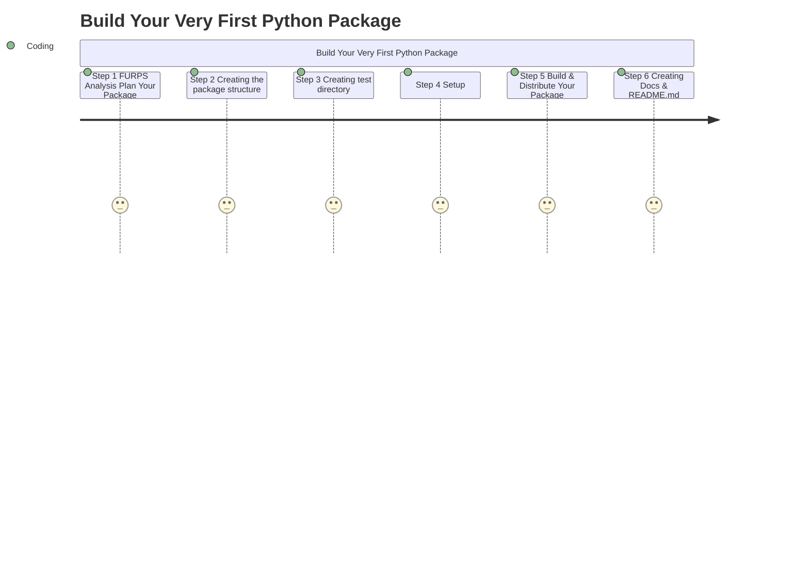
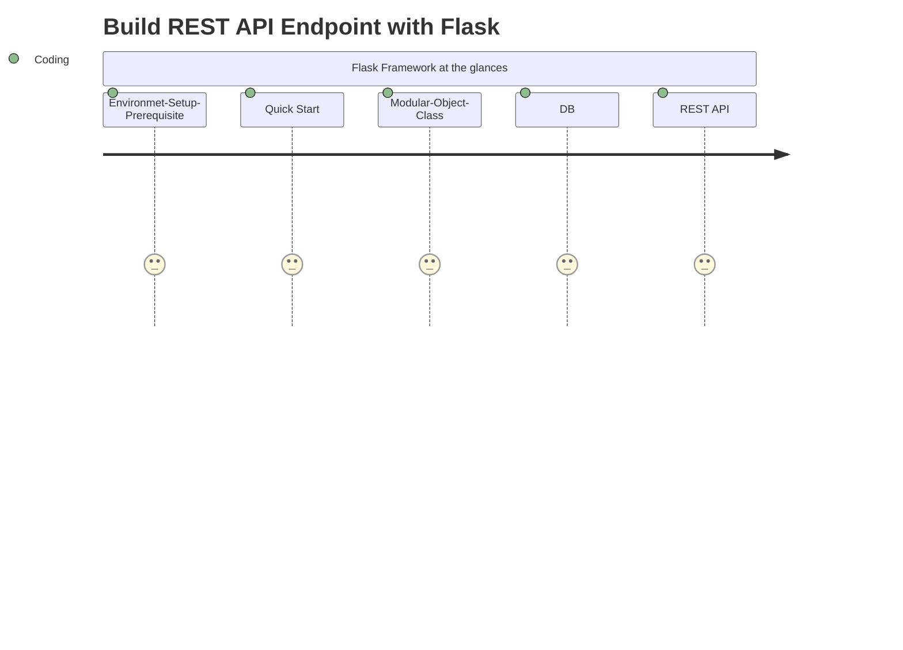

# SI-UKKW-SIWP2005_OOP_2024 Object-Oriented Programming

>  *Hendrik Tampubolon*
>  <a href="mailto:hendrik.gian@gmail.com">Reach Me!</a>
 



## Overview
> "Effective software development begins with a robust design. Object-oriented design serves as a blueprint for developers to conceptualize applications before writing any code, facilitating the breakdown of ideas into reusability and mantainable code which through **F**unctionality, **U**sability,**R**eliability, **P**erformances, and **S**upportability **(FURPS)** analysis.  This course is dedicated to mastering the foundational principles of object-oriented design, delivered in an engaging and interactive manner to accelerate your learning process. This Course (SIWP2005) will cover an introduction to OOP Princples including objects, classes, *Abstraction, Polymorphism, Inheritance,and Encapsulation* **(APIE)**. Beside, a practical hand-on will be introduced in Python & Javascript. In addition, FURPS requirements and analysis will be delivered with *Universal Modeling Language(**UML**)* such as use cases diagram and class diagram. 

## Learning Objectives
- understanding the idea of object-oriented programming design and its terminology 
- understanding on how to implement OOP in python
- able to build your own python package
- able to develop endpoint REST API

## SIWP2005_PBO Course Roadmaps




## Part I Object-Oriented Fundamentals



### Object-Oriented Thinking
> seeing everything is an object

***Fun fact
> Did you know that everything in Python is an object?
> Indeed!, all data types, structures, functions and classes are treated as objects. event Null, None is a type of object. Hence,  makes it very flexible

### Objects and Classes
- Classes:
    - one of the building-blocks of Object-Oriented Programming that acts as a ***Blueprint*** where the *data* and the *actions* of the *objects* are defined
    
- Instance:
    - a concrete object that is created from the class ***Blueprint***
- Methods:
    - an “action” defined in the class that the instances of
        the class can perform. 
- Object:
    - a concrete instance of a class stored in memory


- More about Methods, Attributes, and Members

### The Fourth of APIE Components 
> 


### FURPS Analysis and Design
> FURPS is crucial step when developed a well-structured, reusable, and maintainable software into end product. 



### Converted all into Use Case and Class Diagram with UML
> In this section, we only cover a short introduction to UML, how to prepare requirement analysis, provide a simple use case diagram, then translate it into Class Diagram. 

- Use Case Diagram

- Class Diagram


## Part II: Practical OOP with Python



### Revisited Python Data Types
- Integers (int): Used for whole numbers.

```python!
x = 10
print(x)
print(type(x))

```

- Floating Point Numbers (float): Used for decimal numbers.
```python
y = 10.5
print(y)
print(type(y))

```
- Strings (str): Used for sequences of characters.
```python
name = "Katerine"
print(name)
print(type(name))

```

- Booleans (bool): Used for true/false values.

```python
is_active = True
print(is_active)
print(type(is_active))

```

- Lists: Used for ordered sequences of values.

```python
courses = ["OOP", "Intro to Programing", "Data Structure", "Data Science"]
print(courses)
print(type(courses))


```

- Tuples: Similar to lists, but immutable.

```python
coordinates = (10, 20)
print(coordinates)
print(type(coordinates))
```

- Sets: Used for unordered collections of unique elements.

```python
unique_numbers = {1, 2, 3, 3, 2}
print(unique_numbers)  # Duplicates will be removed
print(type(unique_numbers))

```

- Dictionaries (dict): Used for unordered collections of key-value pairs.
```python
siswa = {"nama": "KATHERIN", "nim": 4x2023xxx, "enrolled": siwp2005}
print(siswa)
print(type(siswa))

```


> Note:
> HW#1 and HW2 will be posted on UVC, stay tuned!

## From Mid-Term ~ Final Project

## Part III: Build Your Very First Python Package

> HW#3 will be posted on UVC, stay tuned!

## Part IV: Build REST API Endpoint with Flask


